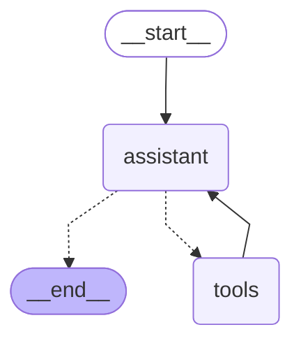
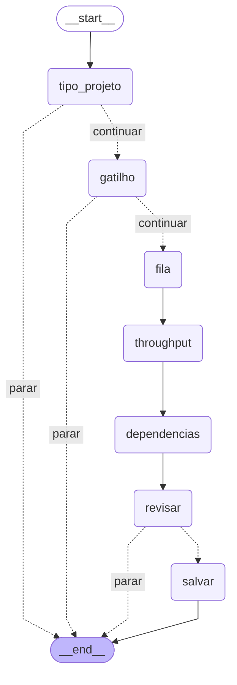

# Custod.IA — do desenho ao código

> Apresentação à gerência · Custódia de Ativos PF · Engenharia
> Python · LangGraph · IaraGenAI

Conteúdo do deck de 16 slides, em texto. O arco: **conquista → tensão → o que falta →
a virada → a decisão → o motor → a solução → governança → valor → o pedido.**

---

## 1 · Capa

# Do desenho ao código.

Custod.IA — o agente que faz a arquitetura de referência chegar ao repositório.

---

## 2 · Onde chegamos

# A arquitetura de referência está de pé.

Padrões de projeto, camadas, regra de dependência, decisões registradas em ADR, o
desenho do worker, o desenho da infraestrutura. **O mapa existe e está acordado.**

| | |
|---|---|
| **Definido** — Padrões e camadas | Organização por camada, regra de dependência, contratos entre as peças. |
| **Registrado** — ADRs | As decisões técnicas escritas, com contexto e consequência — não folclore de corredor. |
| **Materializado** — Templates de referência | Projetos-molde que mostram, em código, como o padrão se parece na prática. |

> E foi aí que apareceu a pergunta difícil: como isso vira código, todo dia, em todo projeto?

---

## 3 · O problema

# Mapa não vira código sozinho.

Documento é **passivo**. Skill, playbook e guia dependem de alguém lembrar que
existem, abrir, interpretar e aplicar — projeto a projeto, dev a dev, sprint a sprint.

- **A distância entre o desenho e o código é humana** — e por isso varia. Duas squads
  leem a mesma página e entregam dois projetos diferentes.
- **A conformidade vira auditoria depois**, quando o custo de corrigir já é alto, em
  vez de garantia antes, quando ainda é barato.
- **Quem entra novo paga o pedágio inteiro**: semanas até saber o que é padrão da casa
  e o que é preferência de quem escreveu.

> Precisamos de estratégia e técnica para aplicar a arquitetura no código — não de
> mais documentação sobre ela.

---

## 4 · O que falta

# As ferramentas de mercado são boas — e seguem com a gente.

Devin, Claude Code e os demais entregam valor real, e continuam no nosso dia a dia.
**O que falta não é ferramenta melhor: é o padrão da casa aplicado por cima dela**,
de forma consistente, em todo projeto novo.

| | |
|---|---|
| **Contexto** | Nossa arquitetura de referência, nossas ADRs e nossas contas AWS não vêm de fábrica em nenhuma ferramenta. É conhecimento nosso, e alguém precisa colocá-lo no caminho. |
| **Fronteira** | Parte do trabalho é decisão que já foi tomada e não deve ser reinterpretada. Sem uma fronteira explícita, tudo vira interpretação — inclusive o que já era regra. |
| **Repetibilidade** | O que é padrão precisa sair igual todas as vezes. Isso é propriedade de código, não de conversa — por melhor que a conversa seja. |
| **Reaproveitamento** | Um bom prompt resolve um projeto. Um harness resolve todos os projetos — e continua valendo quando o modelo, ou a ferramenta, mudar. |

> Esse padrão aplicado é o que estamos construindo. Ele não substitui as ferramentas:
> ele dá a elas o contexto e o trilho da nossa arquitetura.

---

## 5 · A virada

# A pergunta não é *qual ferramenta usar*. É **quando usar cada tipo de fluxo**.

| | Fluxo determinístico | Fluxo com LLM |
|---|---|---|
| **Quem decide o passo** | O código — arestas explícitas do grafo. | O modelo, a partir do contexto. |
| **Mesma entrada** | **Sempre a mesma saída.** | **Saída não garantida.** |
| **Serve para** | Coletar requisitos, validar, configurar infra, gravar decisão. | Interpretar texto livre, explicar o domínio, escrever código a partir de uma decisão já fechada. |
| **Risco** | Nenhum. Custo de token: zero. | Alucinação e drift — por isso, sempre com freio. |

> O harness é quem sabe a diferença — e escolhe o trilho certo a cada passo.
> É daí que vem a assertividade.

---

## 6 · A decisão

# Construir o harness em casa, sobre o que o banco já tem.

Estudamos o que existe no mercado e dentro do banco, e a decisão foi por uma solução
própria por um motivo específico: **o harness é nosso — evoluímos no nosso ritmo e
reaproveitamos a mesma engine em outras soluções.**

**Motivo 01 · A engine é ativo nosso**
Orquestração, guardrails, ferramentas e integração com a plataforma do banco ficam numa
base que já serve à próxima solução — não só a esta.

**Motivo 02 · Evolui na nossa agenda**
Uma necessidade nova da custódia vira feature quando decidirmos, com o contexto que só
nós temos, sem depender de roadmap de terceiro.

**Motivo 03 · Assenta sobre o IaraGenAI**
Modelos democratizados, gateway autenticado e base de conhecimento vetorial já existem
na casa. Consumimos a plataforma em vez de construir outra.

> Não estamos construindo plataforma de IA, nem substituindo ferramenta de codificação.
> Estamos construindo o trilho que aplica a nossa arquitetura — e ele é reaproveitável
> por construção.

---

## 7 · O motor

# LangGraph, em uma frase: o fluxo do agente vira um diagrama.

É uma biblioteca de orquestração. Em vez de o comportamento do agente ficar espalhado
em código, ele é declarado como um **grafo** — caixas que fazem uma coisa cada, e setas
que dizem para onde ir depois.

| | |
|---|---|
| **Nó** — uma caixa faz um passo | Perguntar a fila, consultar a AWS, chamar o modelo, gravar a spec. Cada passo é isolado — dá para testar e trocar um sem mexer nos outros. |
| **Aresta condicional** — a regra fica visível | "Se não confirmou, encerra sem gravar" é uma seta no diagrama, que se lê e se audita — não um `if` perdido no meio de duzentas linhas. |
| **Pausa e retomada** — a pergunta sai de quem pergunta | O grafo congela, descreve o que precisa saber e espera. Hoje quem responde é o terminal; amanhã pode ser uma tela web ou um bot — sem tocar no fluxo. |
| **Um motor só** — os dois trilhos no mesmo lugar | Fluxo determinístico e fluxo com LLM são grafos na mesma biblioteca. Uma forma de orquestrar, e a engine inteira reaproveitável. |

> É por isso que ele é a escolha certa para um harness: o que decide o próximo passo
> deixa de ser implícito e passa a ser desenho — legível para quem revisa, estável para
> quem mantém.

---

## 8 · O grafo hoje

# O que já está desenhado e rodando.

Três grafos no mesmo motor. **Um usa LLM; dois não usam nenhum token** — e é o harness
que roteia cada pedido para o trilho certo.

> Os diagramas abaixo não foram desenhados à mão: saem do grafo compilado, pelo comando
> `/grafo`. Se a estrutura mudar no código e o desenho não for regerado, o diff denuncia.

### Conversa · com LLM — loop ReAct



O modelo decide se precisa de ferramenta — é a seta tracejada para `tools`, e a volta
para `assistant` é o resultado. Sem pedido de ferramenta, responde e encerra. As
ferramentas: ler e listar arquivos, escrever, rodar Maven e **buscar na base de
conhecimento**.

### `/initialize` · determinístico — coleta da spec



As três setas `parar` são as regras de negócio visíveis: "App ainda não existe",
"Schedule ainda não existe" e "não confirmou". Nenhum nó chama modelo, e só o último
escreve em disco — **desistir em qualquer ponto não deixa rastro**.

### `/infra` · determinístico — Terraform por ambiente

O grafo do `/infra` tem 34 nós e não cabe aqui de forma legível — a maior parte é a
cadeia de perguntas de identidade da aplicação (sigla, produto, squad, e-mails, tags de
FinOps). O desenho completo está em
[`.custodia/grafos/infra.mmd`](../.custodia/grafos/infra.mmd). A forma dele, em uma
frase:

```
tipo → ambientes → validar_perfis → confirmar_perfis → identidade da aplicação
   → ⟳ ciclo por ambiente (cluster, vpc, subnets, cidrs, filas, vazão, sts)
   → revisar → escrever
```

O ciclo é a aresta `fechar_ambiente → conectar_ambiente`, que repete o bloco de
perguntas para dev, hom e prod. Quem chama a AWS nunca pausa — **retomar não refaz
consulta de rede**.

---

## 9 · Na prática

# Custod.IA — o agente da custódia.

O desenvolvedor entra na pasta do repositório e digita `custodia`. Ali dentro há
**duas coisas no mesmo lugar**: uma conversa que conhece o nosso domínio, e comandos
que não improvisam.

```
==============================================================
  Custod.IA 0.2.0
  Agente da custódia de ativos PF
==============================================================

> qual é o padrão de retry do listener SQS na nossa arquitetura?

  ● buscar_conhecimento  consulta a KB da arquitetura de referência
  Resposta ancorada no documento oficial, com a fonte citada.

> /initialize   wizard determinístico — nenhum token de LLM
> /infra        terraform de dev, hom e prod — lendo a AWS de verdade
```

> Texto solto → conversa assistida por LLM. Comando com barra → 100% determinístico.
> A separação é deliberada e visível para quem usa.

---

## 10 · Entrega 01 · RAG da arquitetura

# A arquitetura de referência, respondendo.

O agente **decide se precisa consultar** a base vetorial da arquitetura antes de
responder. Não busca sempre — buscar sempre custa token e traz ruído. Busca quando a
pergunta pede.

- **A base é a do banco.** A indexação vem da solução interna de embedding no
  IaraGenAI; o agente consome a Knowledge Base, não mantém índice paralelo.
- **A decisão de buscar é do agente.** É exatamente aqui que a IA agrega: julgar se a
  pergunta é sobre o nosso padrão ou sobre Java genérico.
- **A resposta vem ancorada no nosso documento**, não no treinamento do modelo. Isso é
  a diferença entre consultar a arquitetura e ouvir um palpite plausível.
- **O efeito prático:** a arquitetura de referência deixa de ser um documento que
  ninguém abre e passa a responder no lugar onde o dev está — o terminal.

---

## 11 · Entrega 02 · Starter de projetos

# Um projeto novo que já nasce dentro do padrão.

Um starter **determinístico** de projetos Spring Boot: infraestrutura configurada e
padrões de projeto aplicados, seguindo a arquitetura de referência — por construção,
não por revisão.

```
/initialize  →  spec.json  →  /infra  →  /generate
determinístico  a decisão    terraform   aqui, sim,
sem LLM         versionada   dev/hom/    o LLM escreve
                e revisável   prod       (a partir da spec)
                em PR         com dados
                              reais da
                              conta AWS
```

- **Ele oferece o que existe.** Cluster, VPC, subnets e filas vêm listados da conta,
  em vez de pedir ao dev que digite identificadores de cabeça.
- **O autoscaling é calculado, não copiado.** Sai de uma fórmula sobre vazão,
  concorrência e tempo de processamento — e a conta inteira aparece na tela antes de gravar.
- **Nada é escrito antes da confirmação.** Cancelar não deixa rastro no projeto.

---

## 12 · Governança

# Onde a IA entra, ela entra com freio.

Essa é a diferença entre um agente de mercado e um agente da casa: **os limites são
código**, não recomendação no prompt.

1. **A spec é a fronteira.** Antes dela, tudo é determinístico. Depois dela, se o
   modelo errar, ele erra escrevendo código — não errando o que foi decidido.
2. **Human-in-the-loop obrigatório.** Toda escrita em arquivo e todo comando de build
   param e pedem aprovação, com o conteúdo na tela. Nada acontece à revelia do dev.
3. **Sandbox.** As ferramentas do agente estão presas à pasta do projeto. Ele não
   escapa dela.
4. **Só leitura na nuvem.** O agente consulta a AWS, nunca aplica. Quem aplica é o
   Terraform, pelo pipeline de sempre, com a aprovação de sempre.
5. **Decisão auditável.** A `spec.json` vai para o repositório: o que foi decidido
   sobre o projeto é revisado em PR, separado do código gerado a partir dela.

---

## 13 · O que muda

# O que a gerência ganha com isso.

| | |
|---|---|
| **Conformidade** — Padrão por construção | O projeto nasce aderente à arquitetura de referência. A revisão deixa de ser caça a desvio e vira discussão de negócio. |
| **Custo** — Token onde faz diferença | O que é regra vira código e custa zero. O modelo é acionado só onde julgamento é necessário — e a conversa decide se precisa buscar antes de buscar. |
| **Tempo** — Setup em minutos | Configuração de projeto e infraestrutura deixa de ser uma semana de copiar-colar-adaptar entre repositórios. |
| **Conhecimento** — Padrão que não evapora | A arquitetura fica no agente, não só na cabeça de quem a escreveu. Quem entra novo já produz dentro do padrão. |

> O que passamos a medir a partir daqui: tempo até o primeiro deploy de um projeto
> novo, desvios de arquitetura encontrados em revisão, e custo de token por projeto
> configurado.

---

## 14 · Visão

# Custod.IA não é um script. É um produto.

Ele já é instalável, versionado e distribuído internamente — `pip install custodia-cli`,
pelo Artifactory do banco. Tem versão, tem release, tem quem usa. **O que falta é
tratá-lo como produto na nossa agenda.**

**Horizonte 01 · Evoluir — Fechar o ciclo**
Geração do `pom.xml` e do listener a partir da spec; habilitar App e Schedule além do
Worker; retomar uma sessão interrompida.

**Horizonte 02 · Democratizar — Toda a custódia usando**
Onboarding das squads, documentação viva, coleta de uso e feedback para priorizar o
backlog com dado, não com achismo.

**Horizonte 03 · Expandir — Além da custódia**
O motor é o mesmo: fluxo determinístico + LLM sobre o IaraGenAI. Trocar o domínio e a
arquitetura de referência atende outras áreas.

---

## 15 · Linha do tempo

# O caminho já está desenhado. A data, ainda não.

A sequência das próximas entregas está definida e priorizada. **O calendário é a
decisão que falta** — ele depende da capacidade que for acordada para o produto.

```
──●─────────────●─────────────●- - - - - - -○- - - - - - -○
 Fundação      RAG da       Starter e      Geração      Piloto e
               arquitetura  infraestrutura do código    expansão
                            ▲
                        ESTAMOS AQUI
   ├────────── entregue ──────────┤├──── previsto, sem data ────┤
```

| Estação | Situação | O que é |
|---|---|---|
| **Fundação** | Entregue | CLI instalável pelo Artifactory, conversa sobre o domínio, guardrails de aprovação e sandbox. |
| **RAG da arquitetura** | Entregue | O agente decide quando consultar a base vetorial da arquitetura de referência no IaraGenAI. |
| **Starter e infraestrutura** | Entregue — **estamos aqui** | Wizard determinístico da spec e Terraform de dev, hom e prod lendo as contas AWS reais. |
| **Geração do código** | Previsto | O `pom.xml` e o listener escritos a partir da spec fechada, e o Worker acompanhado por App e Schedule. |
| **Piloto e expansão** | Previsto | Squads-piloto na custódia, métricas de uso e o motor levado a outras áreas com arquitetura própria. |

> Linha cheia é o que já roda em máquina de desenvolvedor. Linha tracejada é escopo
> previsto e priorizado, ainda sem data comprometida — assumir prazo antes de acordar
> capacidade é como a iniciativa vira dívida.

---

## 16 · O pedido

# Esta é a próxima etapa do que já construímos.

- **Reconhecer a Custod.IA como produto** — com dono, backlog e espaço na capacidade
  do time, e não como iniciativa paralela de quem tem tempo sobrando.
- **Squads-piloto** para os próximos projetos novos da custódia, com acompanhamento
  das métricas acordadas.
- **Espaço para apresentar às demais áreas**, começando por quem já tem arquitetura de
  referência escrita e o mesmo problema de aplicá-la.

> A arquitetura de referência já existe. A Custod.IA é como ela chega ao código.
