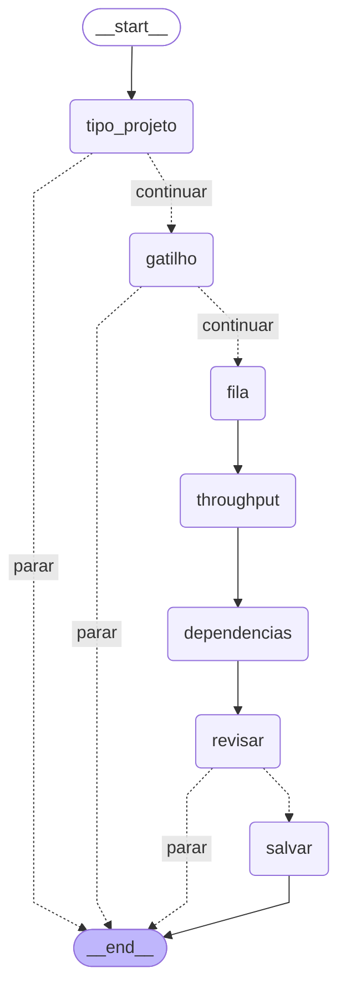

# Arquitetura — como este agente funciona

Documento de aprendizado. Explica **o que** cada peça faz, **por que** ela existe
e **onde mexer** quando for evoluir o agente.

---

## 1. O problema: um wizard não pode alucinar

O `/initialize` faz perguntas cujo resultado vira configuração de infraestrutura
real. Se ele "inventar" que o dev escolheu Aurora RDS, alguém vai subir um banco
sem precisar. Então a primeira decisão de arquitetura foi:

> **O `/initialize` não usa LLM. Nenhum.**

Isso não é preguiça — é o desenho correto. Vale a pena entender a diferença entre
os dois modos, porque o agente vai usar **os dois**:

| | Fluxo determinístico | Fluxo com LLM |
|---|---|---|
| Quem decide o próximo passo | o código (arestas do grafo) | o modelo |
| Mesma entrada → mesma saída | sempre | não garantido |
| Bom para | coletar requisitos, validar, gravar | escrever código Java, interpretar texto livre |
| Risco | nenhum | alucinação, drift |

O `/initialize` é **coleta de requisitos** → determinístico. Os comandos futuros
(`/generate`) escrevem código Java/Terraform → aí sim faz sentido usar o Claude,
mas **partindo de uma spec que já está fechada e validada**.

Essa é a ideia central: **a spec é a fronteira**. Antes dela, tudo é determinístico.
Depois dela, se o LLM errar, ele erra escrevendo código — não errar *o que foi decidido*.

---

## 2. Por que LangGraph, se não tem IA no wizard?

Pergunta justa: dava para fazer com uma sequência de `input()`.

O que ganhamos usando o grafo:

1. **O fluxo vira um diagrama explícito.** As regras de negócio ("App encerra com
   aviso", "Schedule encerra com aviso") são *arestas condicionais* que dá para ler
   e auditar, não `if`s escondidos no meio de 200 linhas.

2. **`interrupt()` separa "a pergunta" de "quem pergunta".** O grafo emite um JSON
   descrevendo a pergunta e congela. Hoje quem responde é o terminal; amanhã pode
   ser uma UI web ou um bot no Slack — **sem tocar no grafo**.

3. **Um motor só.** Os comandos determinísticos e os comandos com LLM rodam no mesmo
   LangGraph. Você aprende uma orquestração, não duas.

### Conceitos do LangGraph usados aqui

- **State** — um dicionário que atravessa o grafo. Cada nó devolve um dict *parcial*
  e o LangGraph faz o merge. Aqui é o `InitializeState`.
- **Node (nó)** — uma função `state -> dict`. Um passo do fluxo.
- **Edge (aresta)** — "depois do nó A vai para o nó B".
- **Conditional edge** — uma função olha o state e devolve para onde ir. É assim que
  "App" desvia para o `END`.
- **Checkpointer** — guarda o state entre execuções. **Obrigatório** para usar
  `interrupt()`, porque é ele que segura o estado enquanto o grafo está pausado.
- **`thread_id`** — identifica a conversa. É por ele que o checkpointer sabe qual
  estado restaurar ao retomar.

---

## 3. O fluxo do `/initialize`



As saídas `parar` são, na ordem: "App ainda não existe", "Schedule ainda não existe" e
"não confirmou na revisão".

Repare que **nenhuma escrita em disco acontece antes da confirmação**. Os caminhos
que terminam em "feature indisponível" ou "cancelado" não deixam rastro.

> Este diagrama é **gerado** pelo `/grafo`, a partir do grafo compilado — não é
> desenhado à mão. Os três grafos ficam em
> [`.custodia/grafos/`](../.custodia/grafos), incluindo o do `/infra`, grande demais
> para caber aqui. Depois de mexer em nós ou arestas, rode `/grafo` e commite o que
> mudou.

---

## 4. As camadas

```
cli.py          REPL: roteia texto solto → conversa, /comandos → wizard
   │
   ├── chat.py          a conversa: guarda o histórico e mostra, via stream(),
   │      │             cada chamada de ferramenta enquanto ela acontece
   │      └── graph.py       o agente ReAct: assistant ↔ tools
   │             ├── tools.py     ler/escrever arquivo, Maven (com aprovação s/N)
   │             └── prompts.py   a persona: domínio da custódia + a stack
   │
   ├── ui.py            o `console` (rich) compartilhado por toda a CLI, e os
   │                    DOIS frontends do wizard: navegado (setas, via
   │                    questionary) e digitado ("1,3"), com queda automática
   │                    do primeiro para o segundo. No modo `guiado=True` (só
   │                    o /config) a escolha do frontend é PERGUNTADA antes de
   │                    cada pergunta com opções, e todas ganham exemplo de
   │                    resposta válida
   │
   ├── initialize.py    o grafo do /initialize: nós, arestas e desvios
   │      │
   │      ├── questions.py   as perguntas como DADOS + a validação (fonte única)
   │      └── spec.py        o artefato final: .custodia/spec.json
   │
   └── infra.py         o grafo do /infra, com um ciclo por ambiente
          │
          ├── aws.py            lista clusters/VPCs/subnets/filas pela AWS CLI
          │                     (erro de certificado → repete uma vez com
          │                     --no-verify-ssl, avisando, e o resto da sessão
          │                     já sai assim)
          ├── dimensionamento.py  a fórmula do autoscaling
          └── terraform.py      escreve infra/terraform/ a partir dos templates
```

Os dois grafos determinísticos compartilham `questions.py` e o mesmo par
`interrupt()` + frontend. O `/infra` acrescenta uma regra própria: **nó que chama a
AWS nunca tem `interrupt()`**. Se estivessem juntos, cada retomada refaria as
consultas de rede — porque um nó que pausa re-executa inteiro.

Os dois ramos são independentes de propósito: o da esquerda é **aberto e assistido
por LLM**, o da direita é **fechado e determinístico**. Só o ramo da conversa precisa
de `ANTHROPIC_API_KEY` — e o grafo dele só é construído no primeiro turno, então o
wizard funciona numa máquina sem chave nenhuma.

A regra que amarra tudo: **`questions.validate()` é a única fonte da verdade sobre
o que é uma resposta válida.** É por isso que ter dois frontends de pergunta não
duplica regra nenhuma: o navegado e o digitado produzem um valor e passam os dois
pelo mesmo `validate()`.

- O `ui.py` chama `validate()` para reperguntar na hora, com mensagem amigável.
- O `initialize.py` chama `validate()` de novo, como rede de segurança.

O `ui.py` cuida só de **parsing** (entender `1,3` como duas opções, `s` como sim) —
isso é específico de terminal e pode mudar por frontend. A **regra** é compartilhada.

---

## 5. O padrão human-in-the-loop (a parte mais importante)

É assim que o `cli.py` conversa com o grafo:

```python
estado = grafo.invoke(entrada, config)      # roda até pausar
while estado.get("__interrupt__"):          # pausou pedindo resposta
    pergunta = estado["__interrupt__"][0].value   # o JSON da pergunta
    resposta = perguntar_no_terminal(pergunta)    # o frontend responde
    estado = grafo.invoke(Command(resume=resposta), config)   # retoma
```

Do lado do nó, é só isto:

```python
def no_fila(state):
    return {"queue_name": _perguntar(Q_FILA_SQS)}
```

### ⚠ A pegadinha clássica

Quando o grafo é retomado, **o nó que pausou roda de novo desde a primeira linha**.
`interrupt()` *não* retoma no meio da função — ele re-executa o nó e, dessa vez,
a chamada `interrupt()` devolve o valor que você mandou.

Consequência prática, e por isso os nós deste projeto são tão curtos:

- **um único `interrupt()` por nó**;
- **nenhum efeito colateral antes do `interrupt()`** (nada de escrever arquivo,
  mandar e-mail, chamar API).

Repare que o único nó que escreve em disco — `no_salvar` — não tem `interrupt()`
nenhum. Não é coincidência.

---

## 6. Como evoluir

### Habilitar "App" ou "Schedule" quando a feature existir

A regra mora no catálogo, não no grafo. Em `questions.py`, troque o flag:

```python
Option(value="app", label="App", ..., available=False, note="...")
#                                    ^^^^^^^^^^^^^^^^ vire True
```

Aí é só ligar a aresta correspondente em `initialize.py` para os nós novos, em vez
de `END`.

### Adicionar uma pergunta

1. Declare a `Question` em `questions.py` (com as regras de validação).
2. Crie o nó em `initialize.py` (`return {"campo": _perguntar(Q_NOVA)}`).
3. Ligue no grafo com `add_edge`.
4. Acrescente o campo no `InitializeState` e no `ProjectSpec` (`spec.py`).

O `ui.py` **não muda** — ele já sabe desenhar qualquer pergunta dos tipos
`choice`, `multi_choice`, `text`, `integer` e `confirm`.

### Adicionar um slash-command

Uma entrada nova em `_COMANDOS_UNICOS`, em `cli.py`. O loop do REPL não muda.

### Onde o LLM já entra

Os arquivos `graph.py`, `tools.py` e `prompts.py` são o agente ReAct (Claude +
ferramentas de ler/escrever arquivo e rodar Maven). Hoje quem os usa é a **conversa**
(`chat.py`), acionada por texto solto no prompt ou pelo `/chat`.

O mesmo agente vai servir ao `/generate`, que vai:

1. ler a spec com `load_spec()`;
2. montar um prompt com o que foi decidido (fila, throughput, dependências);
3. deixar o Claude gerar o `pom.xml`, o listener SQS e o Terraform do worker;
4. validar com `mvn validate` / `terraform validate`.

### Trocar o checkpointer

Hoje é `MemorySaver` (memória, some ao fechar). Trocar por `SqliteSaver` faria o dev
conseguir **retomar um `/initialize` no dia seguinte** de onde parou. Uma linha em
`build_initialize_graph()`.

---

## 7. Formato da spec

`<projeto>/.custodia/spec.json`:

```json
{
  "spec_version": 1,
  "generated_at": "2026-07-25T17:30:39+00:00",
  "generated_by": "Custod.IA 0.2.0",
  "project": {
    "type": "worker",
    "trigger": "sqs",
    "sqs": {
      "queue_name": "minha-fila-dev",
      "messages_per_second": 50
    },
    "dependencies": ["dynamodb", "sns"]
  }
}
```

Detalhes de propósito:

- **`spec_version`** é a versão do *formato*, não do agente. Quando o formato mudar,
  os comandos detectam uma spec antiga e avisam, em vez de interpretar errado.
- **A lista `dependencies` é ordenada pela ordem do catálogo**, não pela ordem em que
  o dev digitou. Assim escolher `5,3,1` ou `1,3,5` gera **exatamente o mesmo JSON** —
  o diff no git só muda quando a decisão muda.
- **Commite este arquivo.** Ele é a documentação revisável, em pull request, do que
  foi decidido sobre o projeto — separada do código gerado a partir dele.
